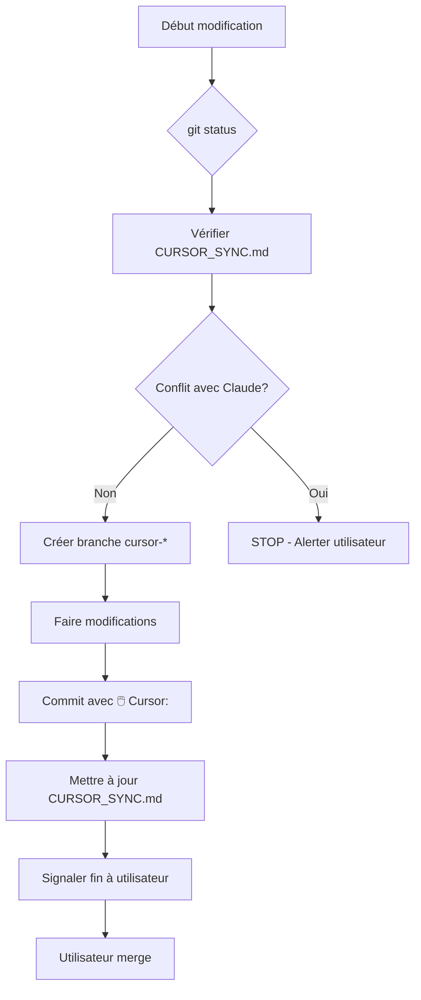

# 🎯 INSTRUCTIONS CURSOR - COORDINATION AVEC CLAUDE CODE

## ⚠️ RÈGLES OBLIGATOIRES

### 1. TOUJOURS travailler sur une branche séparée
- **Nom de branche:** `cursor-[feature]-[YYYYMMDD]`
- **Exemple:** `cursor-translation-fix-20251021`
- **JAMAIS directement sur main**

```bash
# Créer ta branche
git checkout -b cursor-[nom-feature]-$(date +%Y%m%d)
```

### 2. AVANT TOUTE MODIFICATION:
- ✅ Exécuter `git status`
- ✅ Vérifier fichier `CURSOR_SYNC.md` à la racine du projet
- ✅ Checker si Claude Code travaille sur le même fichier

```bash
# Vérification rapide
git status
cat CURSOR_SYNC.md
```

### 3. COMMITS:
- **Préfixe obligatoire:** `🖱️ Cursor:`
- **Format:** `git commit -m "🖱️ Cursor: [description claire]"`
- **Être descriptif et clair**
- **Commiter fréquemment** (petits commits atomiques)

**Exemples de bons messages:**
```bash
git commit -m "🖱️ Cursor: Optimisation traduction - MyMemory en priorité"
git commit -m "🖱️ Cursor: Fix bug affichage hébraïque"
git commit -m "🖱️ Cursor: Ajout système de fallback API"
```

### 4. FICHIERS PARTAGÉS:
- ⚠️ Si modification détectée par Claude → **STOP** et alerter utilisateur
- ❌ Ne **JAMAIS** écraser sans confirmation
- ✅ Consulter `CURSOR_SYNC.md` pour voir si Claude travaille dessus

### 5. MERGE FINAL:
- 🚫 **NE PAS** merger dans main toi-même
- 🚫 **NE PAS** push automatiquement
- ✅ Laisser l'utilisateur gérer le merge final
- ✅ Signaler quand tu as terminé ta partie

## 📁 FICHIER DE COORDINATION

Le fichier **`CURSOR_SYNC.md`** à la racine du projet contient :
- État actuel du projet
- Modifications en cours
- Alertes de conflits
- TODO de coordination

**Consulte-le régulièrement !**

## 🔄 WORKFLOW COMPLET



## 📊 EXEMPLE DE SESSION

```bash
# 1. Vérification initiale
git status
cat CURSOR_SYNC.md

# 2. Créer branche
git checkout -b cursor-new-feature-20251021

# 3. Faire modifications
# [Ton travail ici]

# 4. Commit
git add .
git commit -m "🖱️ Cursor: Description de la modification"

# 5. Mise à jour sync (optionnel, Claude le fait aussi)
echo "Cursor: Terminé modification sur [fichier]" >> CURSOR_SYNC.md

# 6. Signaler à l'utilisateur
# "✅ Modifications terminées sur branche cursor-new-feature-20251021"
```

## 🎯 OBJECTIFS DE CETTE COORDINATION

1. **Zéro conflit** entre toi et Claude Code
2. **Commits propres** et bien tracés
3. **Merge facile** pour l'utilisateur
4. **Pas de perte de code** jamais

## 🤝 COMPLÉMENTARITÉ CURSOR ↔ CLAUDE CODE

### Cursor (toi)
- Interface visuelle puissante
- Modifications en direct
- Refactoring assisté
- Debugging visuel

### Claude Code
- Automatisation avancée
- Scripts système
- Coordination globale
- Vérification qualité

**Ensemble = Productivité maximale !**

---

## 🚨 EN CAS DE DOUTE

**TOUJOURS :**
1. Vérifier `CURSOR_SYNC.md`
2. Demander à l'utilisateur
3. Ne jamais forcer un merge conflictuel

**JAMAIS :**
1. Écraser un fichier modifié par Claude sans confirmation
2. Merger dans main sans l'utilisateur
3. Travailler directement sur main

---

✅ **Tu es maintenant coordonné avec Claude Code !**
🤝 **Bon travail d'équipe !**

---
Généré par Claude Code - Système de coordination automatique
Dernière mise à jour: 2025-10-21
